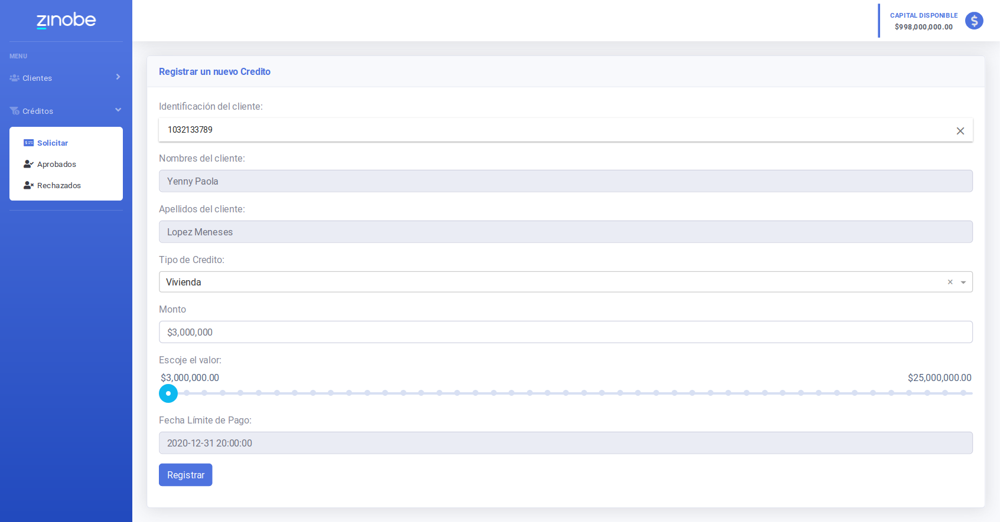
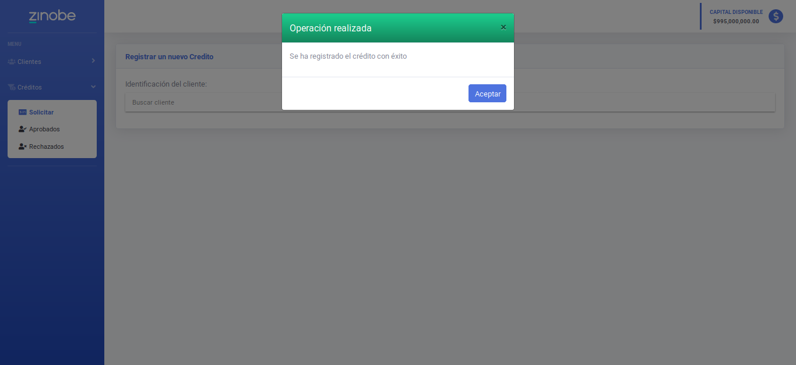
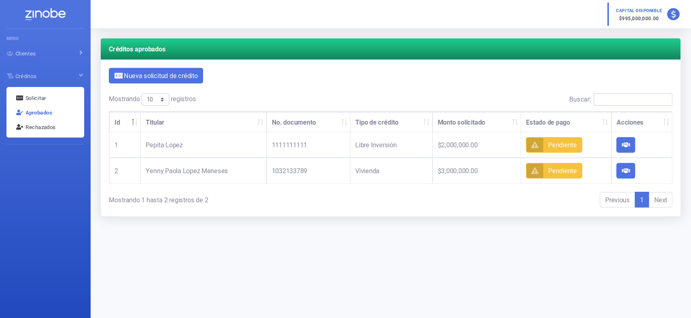
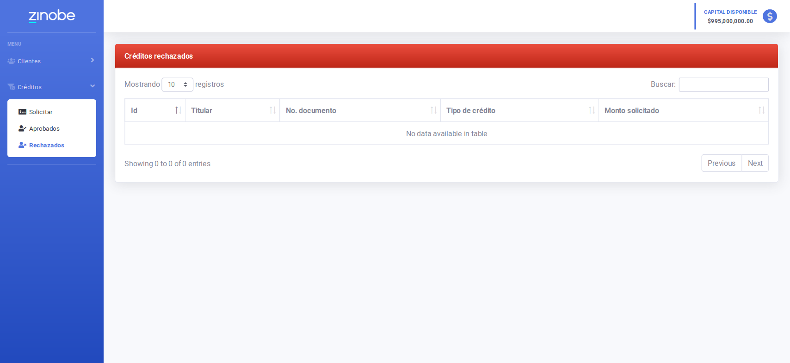
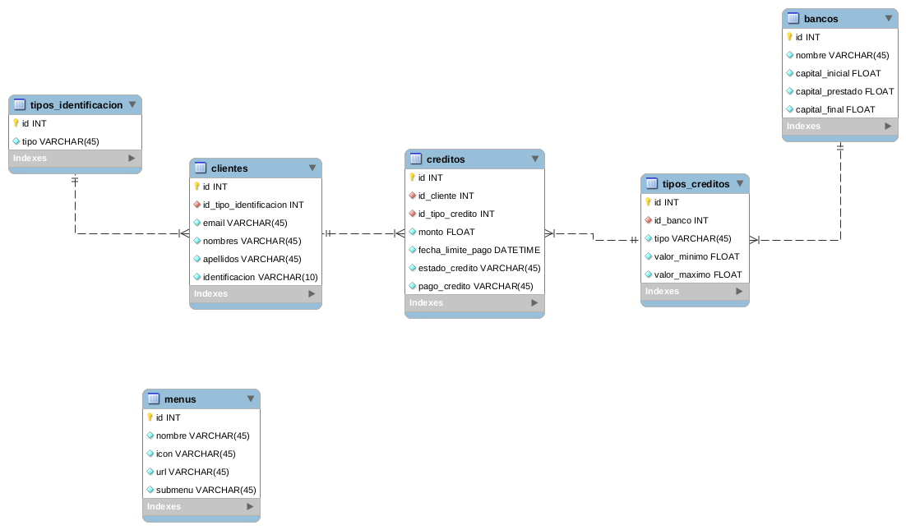

# Zinobe

Este proyecto fue generado con [Angular CLI](https://github.com/angular/angular-cli) version 9.0.7.

## Vista previa de la aplicación Web

 1. Solicitud de crédito
 
 2. Aprobación de cŕédito
  
 3. Lista de créditos aprobados y pendientes por pagar
 

 3. Lista de créditos rechazados
 

## Modelo de datos

* Se realizó este modelo de bases de datos como una guía para la creación de los mocks en json-server.
* La tabla menú quedó aislada ya que no tiene interacción con el modelo de datos.

## Scripts para iniciar el proyecto

Dentro del directorio raíz, ejecutar los siguientes comandos:

1. Instalar de forma global json-server: `npm i json-server -g`
2. Instalación de dependencias: `npm i`
3. Inicialización del servidor fake creado con json-server: `npm run json:server`
4. Inicialización del proyecto en modo desarrollo: `ng serve`

## Variables de entorno

Se encuentran alojadas en el archivo `src/app/common/enviroment/index.ts`

* `baseApiUrl` - Define la url base de la API generada por json-server (Por defecto es `http://localhost:3000`)

## Mocks de datos

* La estructura de datos de json-server está contenida en `server/db.json`
* Para restaurar la estructura inicial de los datos, copiar el contenido de `server/db-example.json` en `server/db.json`

## Funcionalidad del aplicativo

1. Se debe crear un cliente en el menú `Clientes\Registrar Cliente`

2. Para generar un préstamo, se deben dirigir al menú `Créditos\Solicitar` y dentro del formulario, buscar por el número de identificación del cliente registrado en el paso 1.

3. Al momento de enviar la solicitud del crédito, el sistema arrojará una ventana modal con un estado de éxito o error según las reglas del negocio solicitadas por la prueba técnica.

4. Si el crédito es aprobado, automáticamente se descontará el valor solicitado del capital del banco, que se muestra en el header.

5. Para visualizar los créditos pendientes por pagar se deben dirigir a `Créditos\Aprobados`. En este mismo módulo se puede cambiar un crédito pendiente por pagar a pagado. Esta acción también actualiza el valor del capital del banco que se muestra en el header.

6. En el menú `Créditos\Rechazados` se muestra el listado de créditos no aprobados que se registraron desde el módulo de solicitar crédito.

## Nota importante
* Por cuestiones de tiempo, no se implementó la validación para evitar registros duplicados de clientes. Para lo cuál al momento de probar la aplicación, es importante evitar registrar clientes con un mismo número de identificación para obtener los resultados esperados dentro de la prueba técnica.